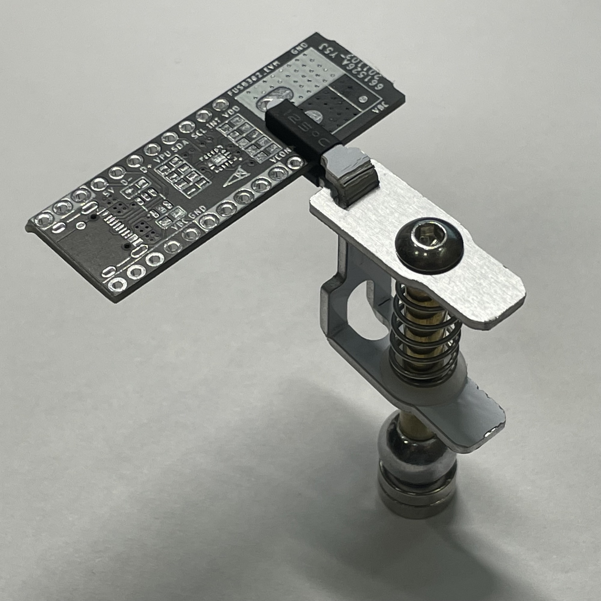

# ODG-Clip

## 免责声明

本资料用于研究专利产品omnifixo的设计，免费供学习交流使用
不得将本资料及使用本资料制作出的仿制版夹具用于商业用途！
[omnifixo的官网](https://omnifixo.com/)

## 模型

提供solidworks 2017模型

|  |  |
| ---------------------------------------------------------- | ------------------------------------------------------------ |

想更大吸力的可以修改底座的模型用3mm厚度的磁铁

## diy成本

物料一般最小起拍5件以上，5套总成本约55元（含邮费），铁板自备

## PCB

PCB将上图中铝基板-上夹片和下夹片拼接，为下图形状，使用单面、厚1.6mm的铝基板打样，需要自己分板，用钳子折弯，铝基板的铝偏软，手工折弯完全OK，做为夹子强度却又不错

## 非标准物料

[碳钢球](https://item.taobao.com/item.htm?id=624826334092)：规格：直径10mm、m4半螺纹、螺纹深度6mm
	

[机米顶丝](https://item.taobao.com/item.htm?id=24646004468)：规格：m4x12
	

[m4外径5mm长30mm双通圆形铜柱](https://item.taobao.com/item.htm?id=610236574211)：规格：5x30 或 5x32
	

[T型尼龙垫圈](https://item.taobao.com/item.htm?id=602642358227)：规格：TW-9/M5
	

[304不锈钢弹簧](https://item.taobao.com/item.htm?id=625358232421)：规格：线径0.7mm高25mm 
	

## 成品展示

| 暂无3D打印底座                           | 夹持PCB效果                                            | 极限夹持宽度13mm左右                                         |
| ---------------------------------------- | ------------------------------------------------------ | ------------------------------------------------------------ |
|  |  |  |

